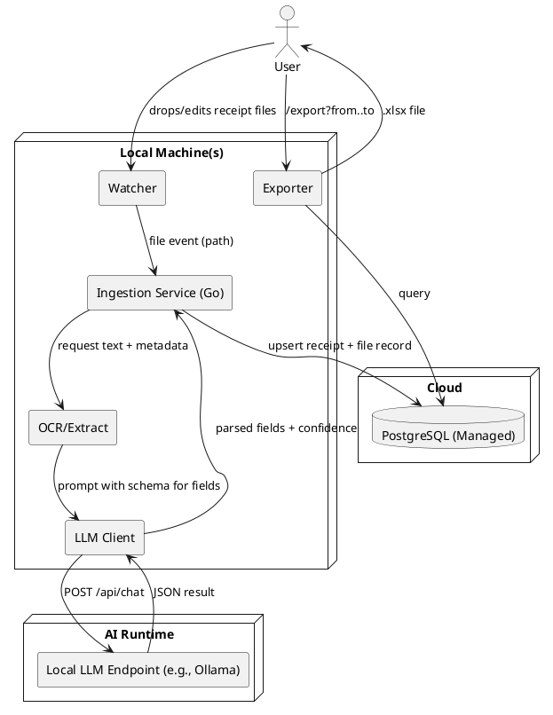

# SPEC-1-AI Receipts Tracker

## Background

You maintain a root folder with nested subfolders containing receipt files—primarily PDFs but sometimes images (JPEG/PNG). The goal is to automate: (1) detecting new/changed receipt files in that folder tree, (2) using AI to read and extract key fields from each receipt, (3) categorizing each receipt, and (4) storing normalized data in a PostgreSQL database for ongoing tracking and analytics. At tax time, the system should export selected data to an Excel workbook for filing and record-keeping. The emphasis is on reliability, minimal manual effort, and accurate categorization from heterogeneous receipt formats.

## Requirements

**Must-have**

* Local Go service (single binary or Docker) that recursively watches one or more root folders for new/updated receipts (PDF/JPG/PNG) and triggers ingestion.
* **Profiles (multi-business):** every receipt belongs to a **profile** (e.g., Business A, Business B). All queries/exports are filterable by profile.
* OCR + parsing: handle native/text PDFs and scanned images; robust to skew/low contrast; extract: merchant, date, subtotal, tax, total, currency, category (auto), payment method, business\_need\_description (free text).
* HTTP endpoints: `/profiles` CRUD; `/ingest` (file path or upload, accepts `profile_id` or resolves by path rules), `/rescan` (re-run extraction), `/export` (to .xlsx, requires `profile_id` + date range), `/healthz`.
* Idempotent processing with content hashing; dedupe **per profile**.
* PostgreSQL **managed (cloud)** persistence with normalized schema; unique indexes to prevent duplicates; audit timestamps.
* Automatic categorization using a local AI endpoint (prompt-based) with a configurable category taxonomy.
* Excel export per profile: date-range filter, fields + category totals, ready for tax filing.
* Basic configuration: list of watched roots (optionally mapped to profiles), include/exclude globs, currency default, timezone, category mapping.
* Observability: structured logs, failure queue ("needs\_review") and retry policy.

**Should-have**

* Simple review workflow (CLI or lightweight local web page) to correct fields and recategorize; corrections feed a rules/learning layer.
* Custom category mapping rules (regex/keyword) layered with AI classification; user-editable.
* Payment method inference from text (e.g., last-4 card, cash) with masking.
* File management: optional rename/move receipts to a normalized folder/filename pattern after successful ingestion.
* Configurable redaction of sensitive fields in stored text blobs.

**Could-have**

* Email inbox ingestion (IMAP) and mobile capture handoff.
* Pluggable cloud OCR/LLM providers (AWS Textract, Google Vision, etc.) behind an abstraction.
* Vendor-specific templates for higher accuracy on common merchants.

**Won't-have (for MVP)**

* Multi-user accounts/RBAC.
* Direct accounting system sync (QuickBooks/Xero).
* Complex web UI; MVP focuses on service + minimal review tool.

**Non-functional goals**

* Accuracy targets (MVP): ≥95% for total/date fields on clear receipts; category top-1 ≥85% with feedback loop.
* Throughput (MVP target): ≥10 receipts/minute on a modern laptop for text PDFs; ≥3 receipts/minute for scanned images.
* Portability: should run on macOS/Linux; Windows optional.
* Resilience: safe reprocessing on new model/rules; zero data loss on crashes.

## Method

### High-level Architecture



### Processing Pipeline

1. **Discover & deduplicate**

   * Recursive watch using a cross-platform watcher.
   * Compute `sha256` of file bytes; check `receipt_files.content_hash` unique index. If exists, skip unless modified time changes.
2. **Type detect**

   * If PDF, attempt text extraction via `pdftotext` first; if insufficient text (e.g., < 20 chars), rasterize pages (e.g., `pdftoppm`) then OCR.
   * If image (JPG/PNG), preprocess (deskew, grayscale, binarize), then OCR.
3. **Text normalization**

   * Collapse excessive whitespace, fix common OCR artifacts (O0, l1), split into header/body.
4. **Field extraction (LLM-first)**

   * Send normalized text + filename cues + folder path to the local AI endpoint with a **JSON Schema**; request structured output.
   * Validate JSON; if invalid or low confidence, fall back to heuristic regexes for date, totals, currency.
5. **Category assignment**

   * Apply rule layer (merchant keywords → category) first; then use LLM category suggestion constrained to allowed taxonomy; resolve conflicts by rule-precedence.
6. **Persistence**

   * Upsert merchant (optional), insert receipt and receipt\_file rows with audit fields.
7. **Post-actions** (optional)

   * Rename/move file to `${YEAR}/${CATEGORY}/${YYYYMMDD}-${merchant}-${total}.${ext}`.
8. **Export**

   * Generate Excel with receipts sheet + pivot-style category totals for a date range.

### API Endpoints (Go, chi router)

* `POST /profiles` — create; body: `{ code, name, default_currency?, timezone?, tax_id? }`.
* `GET /profiles` — list.
* `GET /profiles/{id}` / `PUT /profiles/{id}` — retrieve/update.
* `POST /ingest` — body: `{ path?: string, upload?: multipart, profile_id?: uuid }`; if `profile_id` absent, resolve via `PROFILE_PATH_RULES` or fallback to `DEFAULT_PROFILE_ID`.
* `POST /rescan/{receipt_id}` — re-run extraction.
* `GET /receipts` — filters: `profile_id` (required), date range, category, merchant.
* `GET /export?profile_id=...&from=YYYY-MM-DD&to=YYYY-MM-DD` — returns XLSX.
* `GET /healthz` — liveness/readiness (DB + LLM probe).

### Configuration (env or YAML) (env or YAML)

* `WATCH_ROOTS` (list)
* `PROFILE_PATH_RULES` (list): map path globs → `profile_id` (e.g., `{"glob":"/Users/me/Receipts/BusinessA/**","profile_id":"..."}`)
* `DEFAULT_PROFILE_ID` (used when no rule matches or for API uploads)
* `INCLUDE_GLOBS`, `EXCLUDE_GLOBS`
* `DB_URL` (managed Postgres), `DB_MAX_CONNS`
* `LLM_ENDPOINT` (e.g., [http://localhost:11434](http://localhost:11434)), `LLM_MODEL` (e.g., llama3.2), `LLM_TIMEOUT_SEC`
* `TZ`, `DEFAULT_CURRENCY`
* `CATEGORY_TAXONOMY` file (YAML) for labels and merges; optional per-profile alias file
* `POST_INGEST_FILE_ACTION` (noop|move|rename)

### Prompting & Schema (LLM)

**Prompt template (system message):**

```
You are a receipts parser. Given OCR text and file hints, extract fields and return ONLY JSON matching the provided JSON Schema. Use ISO-8601 dates. Currency 3-letter ISO 4217. If uncertain, set confidence < 0.6 and provide brief rationale.
Allowed categories: [Advertising, Car_Truck, Commissions_Fees, Contract_Labor, Depreciation, Employee_Benefits, Insurance, Interest, Legal_Professional, Office_Expense, Pension_ProfitSharing, Rent_Lease_Vehicles, Rent_Business_Property, Repairs_Maintenance, Supplies, Taxes_Licenses, Travel, Meals, Utilities, Wages, Other].
```

**User content (example):** filename, folder path, and OCR text (first 3k chars), plus country hint.

### Technology Choices (Go + tools)
- **File watching:** fsnotify for cross-platform events.
- **PDF text:** Poppler `pdftotext`; rasterize with `pdftoppm` when needed.
- **OCR:** Tesseract via gosseract; install tesseract + language data in the container.
- **HTTP server & routing:** go-chi/chi v5.
- **DB driver:** jackc/pgx v5; migrations with golang-migrate.
- **Config:** spf13/viper.
- **Logging:** uber-go/zap (JSON logs).
- **Excel export:** xuri/excelize v2 streaming API.

### Containerization
- Multi-stage Docker build producing a small scratch/distroless image with the Go binary; a companion base image with Poppler + Tesseract installed.
- Bind-mount watched folders read-only; pass `DB_URL` for managed Postgres; expose `:8080` for API.

### Error Handling & Review
- Any JSON validation error or confidence < 0.6 ⇒ mark `needs_review=true` and queue for manual fix via CLI route (`/receipts/{id}` PUT) in a simple TUI/Web later.
- Store raw `ocr_text` in `receipt_files` to enable reprocessing with updated models.

## Implementation

### Full DDL (MVP, minimal constraints + indexes)

```sql
-- Extensions (for UUIDs)
create extension if not exists pgcrypto;
-- gen_random_uuid()

-- Profiles (businesses)
create table profiles
(
    id               uuid primary key     default gen_random_uuid(),
    name             text        not null,
    default_currency char(3)     not null default 'USD',
    created_at       timestamptz not null default now(),
    updated_at       timestamptz not null default now()
);

-- Categories seeded with IRS Schedule C - friendly names (global taxonomy)
create table categories
(
    id   serial primary key,
    name text not null
);

-- Receipts (final normalized record)
create table receipts
(
    id             uuid primary key        default gen_random_uuid(),
    job_id         uuid references extract_job (id) on delete cascade,
    profile_id     uuid           not null references profiles (id),
    merchant_name  text           not null,
    tx_date        date           not null,
    subtotal       numeric(12, 2),
    tax            numeric(12, 2),
    total          numeric(12, 2) not null,
    currency_code  char(3)        not null,
    category_id    int references categories (id),
    payment_method text,
    payment_last4  char(4),
    description    text,
    created_at     timestamptz    not null default now(),
    updated_at     timestamptz    not null default now()
);

-- Receipt files (one per source artifact; dedupe lives here)
create table receipt_files
(
    id           uuid primary key     default gen_random_uuid(),
    receipt_id   uuid references receipts (id) on delete cascade,
    profile_id   uuid        not null references profiles (id),
    source_path  text        not null,
    content_hash bytea       not null,
    file_ext     text        not null,
    uploaded_at  timestamptz not null default now(),
    unique (profile_id, content_hash)
);

-- Extract jobs (processing attempts; many per file)
create table extract_job
(
    id                    uuid primary key     default gen_random_uuid(),

-- Ownership/links
    file_id               uuid        not null references receipt_files (id) on delete cascade,
    profile_id            uuid        not null references profiles (id),

-- Processing metadata
    format                text        not null check (format in ('PDF', 'IMAGE', 'TXT')),
    started_at            timestamptz not null default now(),
    finished_at           timestamptz,
    status                text,
    error_message         text,

-- Model outputs (job-level)
    extraction_confidence real,
    needs_review          boolean     not null default false,
    ocr_text              text,
    extracted_json        jsonb, -- structured fields as produced by the parser/LLM
    model_name            text,
    model_params          jsonb
);

-- Indexes for common lookups
create index idx_receipts_profile_date on receipts (profile_id, tx_date);
create index idx_receipts_category on receipts (profile_id, category_id);
create index idx_receipts_merchant on receipts (merchant_name);

create index idx_files_profile_hash on receipt_files (profile_id, content_hash);
create index idx_files_profile_receipt on receipt_files (profile_id, receipt_id);

create index idx_job_profile_status_started on extract_job (profile_id, status, started_at desc);
````

### Go Project Layout

```
.
├── cmd/
│   └── receiptsd/
│       └── main.go
├── internal/
│   ├── server/        # HTTP router, handlers
│   │   ├── router.go
│   │   └── handlers.go
│   ├── ingest/        # watcher + pipeline orchestration
│   │   ├── watcher.go
│   │   └── pipeline.go
│   ├── ocr/           # pdf->text, image OCR
│   │   └── ocr.go
│   ├── llm/           # client for local LLM endpoint
│   │   └── client.go
│   ├── db/            # pgx pool, queries
│   │   ├── db.go
│   │   └── queries.go
│   └── export/        # excelize writer
│       └── export.go
├── db/
│   └── migrations/ 
│       └── 001_init.sql   # use Full DDL above
│   └── Dockerfile
│   └── postgres.yaml
├── Tilefile
├── go.mod
└── go.sum
```
